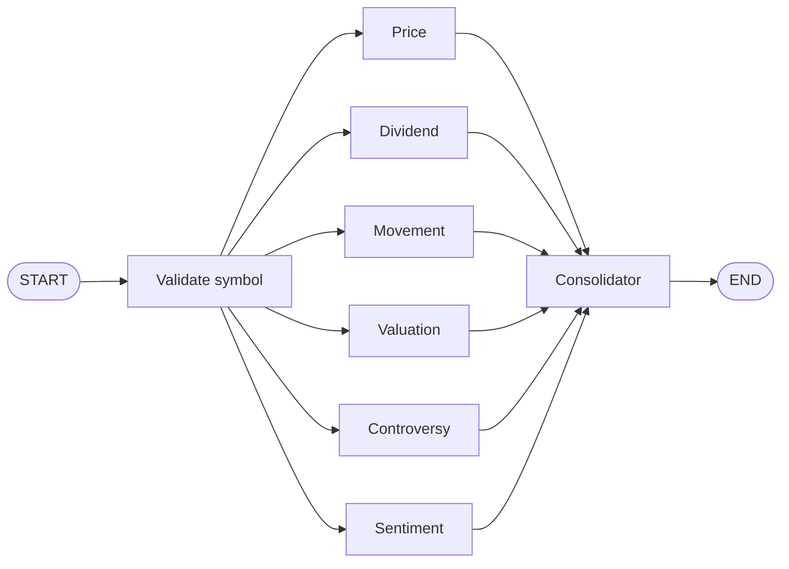

<div align="center">

# PH Stocks Advisor

**AI verdicts for Philippine Stock Exchange stocks — six specialist agents, one 0–100 buy-decision score.**

[](https://github.com/phdwight/agentic-ph-stocks-advisor/actions/workflows/main-ci-cd.yml)
[](https://github.com/phdwight/agentic-ph-stocks-advisor/releases)
[](LICENSE)
[](https://www.python.org/)
[](https://github.com/phdwight/agentic-ph-stocks-advisor/pkgs/container/agentic-ph-stocks-advisor)

`AVOID` · `DON'T BUY` · `WAIT` · `BUY` · `STRONG BUY`

Built with **LangGraph + LangChain** (OpenAI and/or Anthropic) · Python ≥ 3.14

</div>

> [!IMPORTANT]
> **Educational use only — this is not financial advice.** This project is not a
> financial adviser, broker, or dealer, and is not registered with the Philippine
> SEC, BSP, PSE, or any regulator. Output is generated by AI and **may contain
> errors**. Nothing here is a recommendation to buy, sell, or hold any security.
> You use it voluntarily and at your own risk — always consult a licensed
> financial professional before investing.
> **[Read the full disclaimer →](#12--disclaimer)**

| | | | |
|---|---|---|---|
| [01 · What it does](#01--what-it-does) | [02 · Architecture](#02--architecture) | [03 · Quick start](#03--quick-start) | [04 · Using it](#04--using-it) |
| [05 · How analysis works](#05--how-analysis-works) | [06 · Users, auth & portfolio](#06--users-auth--portfolio) | [07 · Configuration](#07--configuration) | [08 · Deployment](#08--deployment) |
| [09 · CI/CD & versioning](#09--cicd--versioning) | [10 · Development](#10--development) | [11 · Security](#11--security) | [12 · Disclaimer](#12--disclaimer) · [13 · License](#13--license--acknowledgements) |

---

## 01 · What it does

Enter a PSE ticker. A **validation node** checks the symbol, six specialist agents run **in parallel** — each owning one analysis dimension — and a **consolidator** synthesises their outputs into an investor-friendly report with a **0–100 verdict score**. The final score is a deterministic weighted average of six rubric-guided sub-scores (a binary BUY / NOT BUY verdict is derived internally for compatibility).

| Agent | Responsibility |
|-------|---------------|
| **Price** | Current price vs 52-week range, price catalysts |
| **Dividend** | Yield, payout ratio, sustainability, REIT rules (RA 9856), income/revenue/FCF trends, structured dividend announcements (ex-date, rate, payment date) |
| **Movement** | 1-year trend, max drawdown, candlestick patterns, TradingView multi-period performance |
| **Valuation** | PE/PB/PEG ratios, Graham Number fair value estimate |
| **Controversy** | Price spike detection, risk factors, news headlines surfaced via the MCP data tool |
| **Sentiment** | Global events impact (wars, pandemics, economic shifts, climate); macro context via the MCP data tool |
| **Consolidator** | Merges all analyses → prose summary + six per-dimension sub-scores (0–100). Weighted average → final score (env-tunable weights). Structured output with regex fallback |
| **Portfolio** | Personalised hold / accumulate / trim advisory for elevated users based on their holdings (on-demand, not part of the main graph) |

## 02 · Architecture



A detailed diagram of the LangGraph flow — including MCP tool calls and the per-node `GraphState` updates — is in [langgraph-flow.drawio](langgraph-flow.drawio) (open with [draw.io](https://app.diagrams.net/) or the VS Code Draw.io extension).

**Data sources** — the data layer cascades through multiple sources for resilience:

| Source | API key | Usage |
|--------|---------|-------|
| **DragonFi** (`api.dragonfi.ph`) | Not required | Primary — price, dividends, valuation, financials, news, symbol validation |
| **PSE EDGE** (`edge.pse.com.ph`) | Not required | Primary for daily OHLCV history, spike detection, declared dividend disclosures (SEC Form 6-1), and company dividend announcements (ex-date, rate, payment date); also the outage fallback for validation, price, financials, and REIT status |
| **TradingView Scanner** | Not required | Multi-period performance & volatility |
| **Tavily** | Optional | Server-side web-search enrichment for the sentiment data tool (not exposed as an LLM tool) |

<details>
<summary><b>SOLID principles applied</b></summary>

- **S**ingle Responsibility — each domain service (`price_service`, `dividend_service`, …) handles one data concern; `tools.py` is a thin re-export façade
- **O**pen/Closed — new agents are added via `AGENT_REGISTRY` in `workflow.py`; new export formats by subclassing `OutputFormatter` and registering in `FORMATTER_REGISTRY`; existing code needs no changes
- **L**iskov Substitution — `build_chat_model(spec)` returns `BaseChatModel` for either OpenAI or Anthropic; agents depend only on the abstract type. `PdfFormatter` and `HtmlFormatter` are drop-in `OutputFormatter` replacements
- **I**nterface Segregation — tool functions return narrow, typed Pydantic models; `OutputFormatter` exposes only `render()`, `write()`, and metadata properties
- **D**ependency Inversion — the LLM is injected into `build_graph(llm=...)`; the repository layer is an ABC with SQLite/Postgres implementations; data tools depend on the `data/tools.py` façade, which transparently swaps the in-process service for a remote MCP client based on configuration

</details>

## 03 · Quick start

**Docker (recommended):**

```bash
cp .env.example .env      # set OPENAI_API_KEY (or ANTHROPIC_API_KEY if LLM_PROVIDER=anthropic)
docker compose up --build -d web worker
open http://localhost:5180

docker compose run --rm advisor TEL          # or a one-shot CLI analysis
docker compose down                          # stop (keeps the pgdata18 volume; -v removes it)
```

| Container | Role | Port |
|-----------|------|------|
| **web** | Flask web UI via Gunicorn + gevent | host 5180 → 5000 |
| **worker** | Celery worker — runs analyses in the background | — |
| **db** | PostgreSQL 18 — persistent report storage | internal |
| **redis** | Redis 7 — Celery broker & result backend | internal |
| **mcp** | MCP server — PSE data tools over Streamable HTTP | host 5184 → 8000 |
| **adminer** | Adminer database UI (log in with the Postgres credentials; LAN only) | host 5181 → 8080 |
| **advisor** | One-shot CLI analysis (optional) | — |

Exported files (PDF / HTML) land in `./output` on the host via a bind mount.

**Local (without Docker):**

```bash
python -m venv .venv && source .venv/bin/activate
pip install -e ".[dev]"                      # add ".[postgres]" for PostgreSQL support
cp .env.example .env                         # set OPENAI_API_KEY or ANTHROPIC_API_KEY
```

<details>
<summary><b>Optional: OpenTelemetry observability stack</b></summary>

Layer the OTel overlay on top of either compose file to add an OTLP collector, Jaeger (traces), Prometheus (metrics) and Grafana (dashboards). The application services are auto-instrumented at container start.

```bash
docker compose -f docker-compose.yml -f docker-compose.otel.yml up -d        # dev
docker compose -f docker-compose.prod.yml -f docker-compose.otel.yml up -d   # prod

open http://localhost:6184    # Jaeger
open http://localhost:6185    # Prometheus
open http://localhost:6186    # Grafana (admin / admin)
```

For production, bake the OTel packages into the image (add `opentelemetry-distro[otlp]` and the relevant `opentelemetry-instrumentation-*` packages to `pyproject.toml`) and set `OTEL_BOOTSTRAP=0` to skip the runtime install.

</details>

<details>
<summary><b>Optional: Langfuse LLM tracing</b></summary>

LLM traces (every agent call, tool invocation, token usage and cost) are sent to [Langfuse](https://langfuse.com) when API keys are present:

```bash
LANGFUSE_PUBLIC_KEY=pk-lf-...
LANGFUSE_SECRET_KEY=sk-lf-...
LANGFUSE_HOST=https://cloud.langfuse.com   # or https://us.cloud.langfuse.com / self-hosted URL
```

Each trace is enriched with:

| Attribute | Value |
|-----------|-------|
| `run_name` | `stock-analysis` or `portfolio-analysis` |
| `user_id` | The authenticated user (or `anonymous`) |
| `session_id` | The Celery `task_id` — groups all spans for one job |
| `tags` | `["stock-analysis", "ph-stocks-advisor"]` etc. |
| `metadata.symbol` | The PSE ticker being analysed |

Set `LANGFUSE_TRACING_ENABLED=false` to disable tracing without removing the keys.

</details>

## 04 · Using it

**CLI:**

| Command | Does |
|---------|------|
| `ph-advisor TEL` | Analyse one stock (also: `python -m ph_stocks_advisor.main TEL`) |
| `ph-advisor SM BDO TEL` | Analyse several sequentially |
| `ph-advisor SM --pdf` / `--html` / `--html --pdf` | Export alongside terminal output (`-o report.pdf` for a custom path) |
| `ph-advisor-pdf MREIT` | Export the latest **saved** report to PDF (`--id 3` for a specific one, `-o` for a path) |
| `ph-advisor-html MREIT` | Same, to HTML |
| `ph-advisor-web` | Web UI on http://127.0.0.1:5000 (`--port`, `--host 0.0.0.0`, `--debug` for the Flask dev server) |

**Web UI** — enter a symbol, the analysis runs in the background, and each workflow step (validation, data fetching, agent execution, consolidation, saving) streams to the browser in real time via **Server-Sent Events** (`/stream/<task_id>`, backed by Redis Pub/Sub; polling fallback at `/status/<task_id>`). The finished report renders in place.

**Public endpoints** (no authentication — used by Docker healthchecks and monitoring):

| Endpoint | Returns |
|---|---|
| `/healthz` | Liveness — `{"checks": {"database": "ok", "redis": "ok"}, "status": "healthy"}`; **200** healthy, **503** otherwise |
| `/version` | The running build's version — **JSON** for `curl`/monitoring, a readable **page** for browsers |
| `/version.json` | Always JSON (explicit machine endpoint) |
| `/disclaimer` | The full disclaimer & terms-of-use page |

```bash
curl -s http://localhost:5180/version
# {"version":"2.1.8","asset_rev":"9f39825ba8"}
```

The version shown always equals the git tag and the published image tag — see [09 · CI/CD & versioning](#09--cicd--versioning).

## 05 · How analysis works

**Trading-session cadence** — freshness follows the PSE calendar (9:00 AM–3:00 PM PHT, Mon–Fri):

- A report is **fresh** if generated after the **most recent trading-day 3:00 PM PHT close**. Weekends roll back to Friday's close — a report generated Friday 4 PM stays fresh through the weekend and Monday until 3 PM.
- **No new analyses run while the market is open.** During the session the newest report is served with a "refreshes after the 3 PM close" note; only when *no* report exists does the request return a "come back after the close" response.
- Outside market hours — before 9 AM, after 3 PM, and all weekend — a stale or missing report triggers a fresh run.
- **Concurrent requests for the same symbol produce exactly one run**: an atomic Redis claim admits one dispatch; everyone else joins the same task id and streams its live progress — same result, no duplicate LLM spend.
- Holidays are not yet in the calendar (weekends only); PSE non-trading dates can be added to `NON_TRADING_DATES` in `infra/trading_calendar.py`.

**Verdict score** — the consolidator judges each dimension against an explicit rubric and emits per-dimension sub-scores (0–100). The final score is a **deterministic weighted average** — the LLM never does the arithmetic — and drives the report's Avoid ↔ Buy meter (marker at `score%`):

| Score | Band | Meaning |
|-------|------|---------|
| 80–100 | **STRONG BUY** | Strong evidence favouring a buy now |
| 60–79 | **BUY** | Favourable on balance |
| 40–59 | **WAIT** | Signals not aligned yet |
| 20–39 | **DON'T BUY** | Unfavourable at the current price |
| 0–19 | **AVOID** | Strong do-not-buy evidence |

Labels are deliberately framed for a **buy decision** — the app never assumes you already own the stock, so there are no "sell"/"hold" words. Colours follow the same semantics: **green = buy, red = avoid**. Tuning levers (env): `SCORE_WEIGHT_*` (normalised by their sum) and `BUY_SCORE_THRESHOLD` (default 60). Dimensions with no data are **excluded from the score** and disclosed in the report rather than guessed.

**Persistence & visibility** — reports are saved after each analysis (SQLite by default, Postgres in Docker). Reports are **shared** — not tied to any user — but each authenticated user only sees the stocks they personally analysed (`user_symbols`); anonymous users (auth disabled) see all reports. User profiles are upserted by `oid` into `users` on every sign-in.

## 06 · Users, auth & portfolio

**User types** — every user has a type controlling access:

| Type | Value | Rate limit | Cache bypass | Per-stock cooldown |
|------|-------|------------|--------------|--------------------|
| **Normal** | `0` | 5 analyses/day (`DAILY_ANALYSIS_LIMIT`) | No — fresh cached reports are served | Once per stock per trading day (resets 3:00 PM PHT) |
| **Elevated** | `1` | Unlimited | Yes — can re-analyse | Once per stock per trading day (resets 3:00 PM PHT) |

All new users start as **Normal**. An administrator promotes via Adminer (`http://<host>:5181`, Postgres credentials, edit `users.user_type`). The type is read from the database on each login, cannot be self-changed, and login upserts never overwrite it.

**Authentication** — the primary sign-in is a **passkey (WebAuthn/FIDO2)**: open self-signup, email-first. A new user enters email + name, accepts the terms, **confirms the email with a 6-digit code** (the newest two codes stay valid, so a resend never strands the email being read), then registers a passkey (Touch ID / Windows Hello / phone). Returning users type their email and authenticate with their device. Microsoft Entra ID and Google OAuth remain as **recovery sign-ins** — a lost device isn't a lockout. When at least one method is configured, sign-in is required for every page; when none is, all routes are public (useful for local development).

```bash
WEBAUTHN_RP_ID=your.domain.com                # host only — passkeys BIND to this domain
WEBAUTHN_ORIGIN=https://your.domain.com       # exact origin used for server-side verification
WEBAUTHN_RP_NAME="PH Stock Advisor AI"        # label shown in the OS passkey prompt
FLASK_SECRET_KEY=<random-secret>
```

For local development use `WEBAUTHN_RP_ID=localhost` and `WEBAUTHN_ORIGIN=http://localhost:5180`. Changing the RP ID later invalidates all existing passkeys. Ceremonies verify against the *configured* origin (never request headers), so the flow is safe behind a reverse proxy or Cloudflare tunnel. The login flow is hardened against account enumeration (decoy credential lists + uniform errors), and anonymous callers cannot attach a passkey to an existing email. Endpoints under `/auth/passkey/*` cover register/login plus authenticated list/delete (passkeys can also be revoked by deleting the row in `webauthn_credentials` via Adminer).

<details>
<summary><b>OAuth recovery setup (Microsoft Entra ID, Google)</b></summary>

**Microsoft Entra ID**

1. **Register an app** in the [Azure portal](https://portal.azure.com) → Microsoft Entra ID → App registrations:
   - **Redirect URI** → `http://localhost:5180/auth/callback` (Web platform)
   - Note the **Application (client) ID** and create a **Client secret**
2. **Enable FIDO2 passkeys** in your Entra ID tenant (Security → Authentication methods → FIDO2 security key)
3. Set the environment variables:

```bash
ENTRA_CLIENT_ID=<your-client-id>
ENTRA_CLIENT_SECRET=<your-client-secret>
ENTRA_TENANT_ID=<your-tenant-id>   # or "common" for multi-tenant
FLASK_SECRET_KEY=<random-secret>
```

**Google OAuth2**

1. Go to [Google Cloud Console](https://console.cloud.google.com/) → APIs & Services → Credentials
2. Create an **OAuth 2.0 Client ID** (Web application type):
   - **Authorized redirect URI** → `http://localhost:5180/auth/google/callback`
   - For Azure deployment also add: `https://<your-app>.azurecontainerapps.io/auth/google/callback`
3. Set the environment variables:

```bash
GOOGLE_CLIENT_ID=<your-google-client-id>
GOOGLE_CLIENT_SECRET=<your-google-client-secret>
```

</details>

**Portfolio holdings (elevated users only)** — record positions, get personalised advice:

1. A **My Position** button appears on any report page for elevated users; a modal asks for **shares** and **average cost**
2. Holdings persist per user per symbol; **Save & Analyse** triggers the **Portfolio Agent** (only after 3:00 PM PHT), which weighs the cost basis and unrealised P/L, the latest analysis report, and the current price
3. If no fresh base analysis exists, one is dispatched first (visible to all users), then the portfolio analysis runs
4. Output: a **Hold / Accumulate / Trim** recommendation with key price levels and risk considerations — **private** to the user who created it

| API endpoint | Method | Description |
|-------------|--------|-------------|
| `/api/holdings/<symbol>` | `GET` / `POST` / `DELETE` | Retrieve / save / remove the user's holding |
| `/api/portfolio-analyse/<symbol>` | `POST` | Trigger portfolio analysis (async Celery task) |
| `/api/portfolio-report/<symbol>` | `GET` | Retrieve the latest portfolio advisory |

## 07 · Configuration

All settings live in `.env` (see [.env.example](.env.example)). At least one LLM key is required — `OPENAI_API_KEY` for the default provider, or `ANTHROPIC_API_KEY` when any agent uses an `anthropic` spec. `MCP_SERVER_URL` is required for analyses — all market-data calls dispatch through the MCP server, with no in-process fallback.

LLM specs are `[provider:]tier` (provider ∈ `openai`|`anthropic`, tier ∈ `large`|`medium`|`small`) and can be set **per agent** — e.g. `LLM_CONSOLIDATOR=anthropic:large` with the specialists on `openai:small`, mixed in one run.

<details>
<summary><b>All environment variables</b></summary>

| Variable | Required | Default | Description |
|----------|----------|---------|-------------|
| `OPENAI_API_KEY` | Cond. | — | OpenAI API key. Required when any agent uses an `openai` spec (the default) |
| `ANTHROPIC_API_KEY` | Cond. | — | Anthropic API key. Required only when any agent uses an `anthropic` spec |
| `LLM_PROVIDER` | No | `openai` | Default provider (`openai` or `anthropic`) when an agent spec omits one |
| `LLM_TEMPERATURE` | No | `0.2` | Sampling temperature (sent to OpenAI; **omitted for Anthropic** — Opus 4.8 / Sonnet 5 reject a caller-set temperature). Alias: `OPENAI_TEMPERATURE` |
| `LLM_MAX_TOKENS` | No | `4096` | Max output tokens applied to Anthropic models (OpenAI ignores) |
| `OPENAI_MODEL_LARGE` | No | `gpt-4o` | OpenAI large tier (falls back to `OPENAI_MODEL` if set) |
| `OPENAI_MODEL_MEDIUM` | No | `gpt-4o-mini` | OpenAI medium tier |
| `OPENAI_MODEL_SMALL` | No | `gpt-4o-mini` | OpenAI small tier (falls back to `OPENAI_MINI_MODEL` if set) |
| `ANTHROPIC_MODEL_LARGE` | No | `claude-opus-4-8` | Anthropic large tier |
| `ANTHROPIC_MODEL_MEDIUM` | No | `claude-sonnet-5` | Anthropic medium tier |
| `ANTHROPIC_MODEL_SMALL` | No | `claude-haiku-4-5` | Anthropic small tier |
| `LLM_CONSOLIDATOR` | No | `large` | Consolidator agent spec — `[provider:]tier` (e.g. `anthropic:large`, `openai:small`, `medium`) |
| `LLM_PORTFOLIO` | No | `large` | Portfolio agent spec |
| `LLM_PRICE_AGENT` … `LLM_SENTIMENT_AGENT` | No | `small` | Per-specialist specs (`LLM_PRICE_AGENT`, `LLM_DIVIDEND_AGENT`, `LLM_MOVEMENT_AGENT`, `LLM_VALUATION_AGENT`, `LLM_CONTROVERSY_AGENT`, `LLM_SENTIMENT_AGENT`) |
| `TAVILY_API_KEY` | No | — | Tavily web search key (graceful degradation when absent) |
| `TAVILY_MAX_RESULTS` | No | `5` | Max results per Tavily search call |
| `TAVILY_SEARCH_DEPTH` | No | `basic` | Tavily search depth (`basic` or `advanced`) |
| `DB_BACKEND` | No | `sqlite` | `sqlite` or `postgres` |
| `SQLITE_PATH` | No | `reports.db` | Path to the SQLite database file |
| `POSTGRES_DSN` | No | `postgresql://localhost:5432/ph_advisor` | PostgreSQL connection string |
| `POSTGRES_USER` | No | `ph_advisor` | Postgres user (Docker Compose only) |
| `POSTGRES_PASSWORD` | No | `ph_advisor` | Postgres password (Docker Compose only) |
| `POSTGRES_DB` | No | `ph_advisor` | Postgres database name (Docker Compose only) |
| `POSTGRES_PORT` | No | `5432` | Host port for Postgres (Docker Compose only) |
| `DRAGONFI_BASE_URL` | No | `https://api.dragonfi.ph/api/v2` | DragonFi API base URL |
| `PSE_EDGE_BASE_URL` | No | `https://edge.pse.com.ph` | PSE EDGE base URL |
| `TRADINGVIEW_SCANNER_URL` | No | `https://scanner.tradingview.com/philippines/scan` | TradingView scanner endpoint |
| `HTTP_TIMEOUT` | No | `15` | HTTP request timeout (seconds) |
| `TIMEZONE` | No | `Asia/Manila` | IANA timezone or UTC/GMT offset (e.g. `Asia/Manila`, `UTC+8`, `GMT-5`) |
| `OUTPUT_DIR` | No | _(empty — cwd)_ | Base directory for exported PDF/HTML files |
| `TREND_UP_THRESHOLD` | No | `5` | % change above which trend = uptrend |
| `TREND_DOWN_THRESHOLD` | No | `-5` | % change below which trend = downtrend |
| `SPIKE_STD_MULTIPLIER` | No | `3` | × daily-return std-dev to flag a spike |
| `SPIKE_MIN_ABS_RETURN` | No | `0.05` | Minimum absolute return to count as a spike |
| `HIGH_VOLATILITY_THRESHOLD` | No | `0.03` | Daily std above this = "high volatility" |
| `OVERVALUATION_MULTIPLIER` | No | `1.3` | price / avg > this = overvaluation risk |
| `DISTRESS_MULTIPLIER` | No | `0.7` | price / avg < this = distress risk |
| `CATALYST_YIELD_THRESHOLD` | No | `3.0` | Dividend yield (%) to trigger catalyst |
| `CATALYST_RANGE_PCT` | No | `65` | % of 52-week range for catalyst detection |
| `CATALYST_DAY_CHANGE_PCT` | No | `0.5` | Daily % change to trigger momentum catalyst |
| `CATALYST_NEAR_HIGH_PCT` | No | `5` | % gap to 52-week high for "near high" catalyst |
| `REDIS_URL` | No | `redis://localhost:6379/0` | Redis connection URL (broker + result backend for Celery) |
| `REDIS_PORT` | No | `6379` | Host port for Redis (Docker Compose only) |
| `MCP_SERVER_URL` | **Yes** | _(empty)_ | URL of the MCP server (e.g. `http://mcp:8000/mcp/` from sibling containers, `http://localhost:5184/mcp/` from the host). All market-data calls dispatch through it — an unset value raises `MCPNotConfiguredError` on the first data call |
| `MCP_PORT` | No | `8000` | Port the MCP server listens on **inside the container** |
| `MCP_HOST_PORT` | No | `5184` | Host port mapped to the MCP container (Docker Compose only) |
| `MCP_CONNECT_TIMEOUT` | No | `60` | Seconds to wait for the MCP session to initialise |
| `MCP_REQUEST_TIMEOUT` | No | `60` | Seconds to wait for a single MCP tool response |
| `LOG_LEVEL` | No | `INFO` | Root log level for every Python service (`DEBUG`, `INFO`, `WARNING`, `ERROR`, `CRITICAL`) |
| `WEB_PORT` | No | `5180` | Host port for the Flask web UI (Docker Compose only) |
| `ADMIN_PORT` | No | `5181` | Host port for the Adminer database UI (Docker Compose only; log in with the Postgres credentials) |
| `ENTRA_CLIENT_ID` | No | — | Microsoft Entra ID application (client) ID (enables login) |
| `ENTRA_CLIENT_SECRET` | No | — | Entra ID client secret |
| `ENTRA_TENANT_ID` | No | `common` | Entra ID tenant ID (or `common` for multi-tenant) |
| `ENTRA_REDIRECT_PATH` | No | `/auth/callback` | OAuth2 redirect path (Microsoft) |
| `GOOGLE_CLIENT_ID` | No | — | Google OAuth2 client ID (enables Google login) |
| `GOOGLE_CLIENT_SECRET` | No | — | Google OAuth2 client secret |
| `GOOGLE_REDIRECT_PATH` | No | `/auth/google/callback` | OAuth2 redirect path (Google) |
| `WEBAUTHN_RP_ID` | No | _(empty — passkeys off)_ | Passkey relying-party ID (host only; `localhost` for dev). Setting this enables passkey sign-in |
| `WEBAUTHN_ORIGIN` | No | `http://localhost:5180` | Exact origin used to verify WebAuthn ceremonies server-side |
| `WEBAUTHN_RP_NAME` | No | `PH Stock Advisor AI` | Label shown in the OS/browser passkey prompt |
| `ZEPTOMAIL_API_KEY` | No | _(unset — console sender)_ | ZeptoMail key for transactional email (report results + signup verification codes). Unset → emails are logged, not sent |
| `EMAIL_FROM_ADDRESS` | No | `customer.success@sakayandgo.com` | Sender address (the exact domain must be verified in ZeptoMail) |
| `APP_BASE_URL` | No | _(falls back to `WEBAUTHN_ORIGIN`)_ | Base URL used for links inside emails |
| `SCORE_WEIGHT_PRICE` | No | `0.15` | Weight of the price sub-score in the 0–100 verdict score |
| `SCORE_WEIGHT_VALUATION` | No | `0.25` | Weight of the valuation sub-score |
| `SCORE_WEIGHT_DIVIDEND` | No | `0.15` | Weight of the dividend sub-score |
| `SCORE_WEIGHT_MOVEMENT` | No | `0.15` | Weight of the movement sub-score |
| `SCORE_WEIGHT_CONTROVERSY` | No | `0.15` | Weight of the controversy sub-score |
| `SCORE_WEIGHT_SENTIMENT` | No | `0.15` | Weight of the sentiment sub-score (weights are normalised by their sum) |
| `BUY_SCORE_THRESHOLD` | No | `60` | Score at/above which the derived binary verdict is BUY |
| `FLASK_SECRET_KEY` | No | _(dev placeholder)_ | Flask session encryption key (also keys the verification-code and decoy-credential HMACs) |
| `DAILY_ANALYSIS_LIMIT` | No | `5` | Max successful first-time analyses per user per trading day (failed queries not counted; resets 3:00 PM PHT / 07:00 UTC) |
| `LANGFUSE_PUBLIC_KEY` | No | — | Langfuse public key (enables LLM tracing with the secret key) |
| `LANGFUSE_SECRET_KEY` | No | — | Langfuse secret key |
| `LANGFUSE_HOST` | No | `https://cloud.langfuse.com` | Langfuse host URL |
| `LANGFUSE_TRACING_ENABLED` | No | `true` | Set `false` to disable tracing even when keys are present |
| `LANGFUSE_TRACING_ENVIRONMENT` | No | `development` | Environment label attached to traces (e.g. `production`, `ci`) |
| `OTEL_ENV` | No | `dev` | `deployment.environment` resource attribute (OpenTelemetry overlay only) |
| `OTEL_BOOTSTRAP` | No | `1` | When `1`, the OTel overlay pip-installs instrumentation at container start; `0` once baked into the image |
| `OTEL_GRPC_PORT` | No | `6182` | Host port for the OTel Collector OTLP/gRPC receiver |
| `OTEL_HTTP_PORT` | No | `6183` | Host port for the OTel Collector OTLP/HTTP receiver |
| `JAEGER_UI_PORT` | No | `6184` | Host port for the Jaeger UI |
| `PROMETHEUS_PORT` | No | `6185` | Host port for the Prometheus UI |
| `GRAFANA_PORT` | No | `6186` | Host port for the Grafana UI |
| `OTEL_SELF_METRICS_PORT` | No | `6187` | Host port for the OTel Collector's self-metrics endpoint |
| `GRAFANA_USER` | No | `admin` | Grafana admin username |
| `GRAFANA_PASSWORD` | No | `admin` | Grafana admin password |
| `WEB_WORKERS` | No | `4` | Gunicorn worker processes |
| `WEB_WORKER_CLASS` | No | `gevent` (compose: `ph_stocks_advisor.web.worker.GeventWorkerNoSSL`) | Gunicorn worker class. Compose uses a custom gevent worker that skips SSL monkey-patching (avoids a Py 3.12 + OpenSSL ≥ 3.5 recursion bug) |
| `WEB_WORKER_CONNECTIONS` | No | `1000` | Max simultaneous connections per gevent worker |
| `WEB_THREADS` | No | `2` | Threads per Gunicorn worker (only with the `gthread` worker class) |
| `WEB_TIMEOUT` | No | `120` | Gunicorn worker timeout in seconds |
| `PG_POOL_MIN` | No | `2` | Minimum PostgreSQL connections in pool |
| `PG_POOL_MAX` | No | `5` | Maximum PostgreSQL connections in pool |
| `REDIS_MAX_CONNECTIONS` | No | `10` | Maximum connections in the shared Redis pool |
| `CELERY_CONCURRENCY` | No | `4` | Celery worker concurrency (prefork processes) |
| `APP_IMAGE` | No | `ghcr.io/OWNER/agentic-ph-stocks-advisor:latest` | App Docker image for `docker-compose.prod.yml` |

</details>

## 08 · Deployment

**Pre-built images** are published to GHCR on every merge to `main` (multi-arch amd64 + arm64). A production host needs only `docker-compose.prod.yml` + `.env` — no source code, no Git:

```bash
mkdir -p ~/ph-stocks-advisor && cd ~/ph-stocks-advisor

# 1. Copy docker-compose.prod.yml from the repo (or download it)
curl -fsSL https://raw.githubusercontent.com/<owner>/agentic-ph-stocks-advisor/main/docker-compose.prod.yml \
  -o docker-compose.prod.yml

# 2. Create .env
cat > .env <<'EOF'
OPENAI_API_KEY=sk-...
POSTGRES_PASSWORD=<strong-password>
FLASK_SECRET_KEY=<random-secret>
# Passkey sign-in (binds to your public domain)
WEBAUTHN_RP_ID=your.domain.com
WEBAUTHN_ORIGIN=https://your.domain.com
WEBAUTHN_RP_NAME=PH Stock Advisor AI
APP_IMAGE=ghcr.io/<owner>/agentic-ph-stocks-advisor:latest
EOF

# 3. Log in to GHCR (only needed for private repos)
echo $GITHUB_PAT | docker login ghcr.io -u <username> --password-stdin

# 4. First launch
docker compose -f docker-compose.prod.yml up -d
```

To update: `docker compose -f docker-compose.prod.yml pull && docker compose -f docker-compose.prod.yml up -d`. With the SSH deploy secrets configured (see below), every push to `main` does this automatically.

<details>
<summary><b>Azure Container Apps (Bicep IaC)</b></summary>

Deploy to **Azure Container Apps** with managed PostgreSQL and Redis. All infrastructure is defined as code via Bicep.

| Azure service | Role |
|---------------|------|
| **Container Registry** | Stores the Docker image |
| **Container Apps — web** | Flask web UI (HTTPS, auto-scaling) |
| **Container Apps — worker** | Celery worker (scales with queue depth) |
| **Container Apps — admin** | Adminer database UI (HTTPS) |
| **Database for PostgreSQL** | Flexible Server (Burstable B1ms, 32 GB) |
| **Cache for Redis** | Basic C0 (TLS only) |
| **Log Analytics** | Container logs & monitoring |

Prerequisites: [Azure CLI](https://aka.ms/install-az-cli) logged in (`az login`), Docker running, `OPENAI_API_KEY` in `.env`.

```bash
export AZURE_PG_PASSWORD='<strong-password>'
./infra/azure/deploy.sh              # first-time: infra + build + push + update apps
./infra/azure/deploy.sh --update     # rebuild image & redeploy (skips infra)
./infra/azure/deploy.sh --infra-only # provision infrastructure only
./infra/azure/teardown.sh            # destroy everything (--yes to skip confirmation)
```

The deploy script creates a resource group (`ph-stocks-advisor-rg` in `southeastasia`), provisions all resources via Bicep, builds and pushes the web image to ACR, updates the Container Apps, and prints the public HTTPS URL.

Customisation via env vars before running `deploy.sh`:

| Variable | Default | Description |
|----------|---------|-------------|
| `AZURE_RESOURCE_GROUP` | `ph-stocks-advisor-rg` | Resource group name |
| `AZURE_LOCATION` | `southeastasia` | Azure region |
| `AZURE_APP_NAME` | `phstocks` | Name prefix for all resources |
| `AZURE_PG_ADMIN_USER` | `phadmin` | PostgreSQL admin login |
| `AZURE_PG_PASSWORD` | _(required)_ | PostgreSQL admin password |
| `IMAGE_TAG` | `latest` | Docker image tag |

**Scaling tiers** — the Bicep template defaults to minimal resources; override via deploy parameters, no code changes needed:

| Parameter | Hobby (~100/mo) | Small (~1K users) | Scale (100K+) |
|-----------|----------------:|-------------------:|--------------:|
| `pgSkuName` / `pgSkuTier` | B1ms / Burstable | B1ms / Burstable | D2ds_v5 / GeneralPurpose |
| `webCpu` / `webMemory` | 0.25 / 0.5Gi | 0.5 / 1Gi | 2 / 4Gi |
| `workerCpu` / `workerMemory` | 0.25 / 0.5Gi | 0.5 / 1Gi | 1 / 2Gi |
| `redisCpu` / `redisMemory` | 0.25 / 0.5Gi | 0.25 / 0.5Gi | 0.5 / 1Gi |
| `redisMaxMemory` | 64mb | 128mb | 512mb |
| `webWorkers` | 1 | 2 | 4 |
| `pgPoolMax` | 5 | 10 | 20 |
| `redisMaxConnections` | 10 | 20 | 50 |
| `celeryConcurrency` | 2 | 4 | 4 |
| `webMaxReplicas` | 1 | 3 | 10 |
| `workerMaxReplicas` | 1 | 3 | 10 |
| **Est. monthly cost** | **~$100** | **~$176** | **~$340** |

```bash
# Small tier (~1K users)
az deployment group create ... --parameters main.bicepparam \
  --parameters webCpu='0.5' webMemory='1Gi' workerCpu='0.5' workerMemory='1Gi' \
    redisMaxMemory='128mb' webWorkers='2' pgPoolMax='10' redisMaxConnections='20' \
    celeryConcurrency='4' webMaxReplicas=3 workerMaxReplicas=3

# Scale tier (100K+ users)
az deployment group create ... --parameters main.bicepparam \
  --parameters pgSkuName='Standard_D2ds_v5' pgSkuTier='GeneralPurpose' \
    webCpu='2' webMemory='4Gi' workerCpu='1' workerMemory='2Gi' \
    redisCpu='0.5' redisMemory='1Gi' redisMaxMemory='512mb' \
    webWorkers='4' pgPoolMax='20' redisMaxConnections='50' \
    celeryConcurrency='4' webMaxReplicas=10 workerMaxReplicas=10
```

</details>

## 09 · CI/CD & versioning

Two GitHub Actions workflows follow a **develop → main** promotion strategy:

| Workflow | Trigger | Jobs | Deploys? |
|----------|---------|------|----------|
| `develop-ci.yml` | push to `develop` | Lint, type-check, unit tests, integration tests | No |
| `main-ci-cd.yml` | push to `main` (+ manual dispatch) | Same checks → **auto version bump & tag** → build & push the GHCR image → deploy | Yes |

Quality gates on every push/PR: **Ruff** (lint + format), **Pyright** (basic mode), **unit tests** (no secrets needed), **integration tests** (real LLM calls, only when the `OPENAI_API_KEY` secret is available). Builds are **path-gated**: the app image rebuilds only when its build inputs change (`Dockerfile`, `.dockerignore`, `requirements.txt`, `pyproject.toml`, `ph_stocks_advisor/**`, `ph_stocks_mcp/**`); deploy jobs run only when the image was rebuilt or `docker-compose.prod.yml` changed — docs/test-only merges skip the build entirely. The repository accepts **merge commits only** (squash/rebase disabled) so `develop` and `main` histories never diverge.

**Automatic versioning** — three things stay in lockstep on every merge to `main`: the version the running app reports, the git tag, and the published image tag. There is no manual bump.

- **Source of truth: git tags (`vX.Y.Z`).** `pyproject.toml` keeps a committed version that acts as the *floor* (seeds the first release; keeps local/offline builds working).
- The `bump` job computes `next = max(latest tag patch+1, pyproject floor)` and pushes **only an annotated tag** — never a commit. Idempotent; works with the stock `GITHUB_TOKEN`.
- `build-images` **bakes that version into `pyproject.toml` before building**, tags the image `latest` and `X.Y.Z` in the same run, then pulls both published tags and **asserts the version reported inside equals the tag** — failing the build on any drift.
- The bump is gated on the same path filter as the image, so a docs-only merge creates neither a tag nor an image — every `vX.Y.Z` tag has a matching `:X.Y.Z` image in GHCR.
- At runtime the app reads the shipped `pyproject.toml`, renders it in the footer, and exposes it at `GET /version`.

| You want | Do this |
|---|---|
| Patch release (default) | Nothing — merge to `main`, get `vX.Y.Z+1` |
| Minor / major release | Raise the floor in `pyproject.toml` (e.g. `2.2.0`) **before** merging; the floor wins over patch+1 |
| A GitHub Release | The tag already exists — `gh release create vX.Y.Z --verify-tag --notes "…"` (never let it create a new tag) |

<details>
<summary><b>Deployment targets, GitHub secrets & variables</b></summary>

Two deployment targets run in parallel after images are published; each is auto-detected from which secrets are configured — enable one, both, or neither:

| Target | Triggered when | How it works |
|--------|---------------|--------------|
| **Azure Container Apps** | `AZURE_CREDENTIALS` secret is set | Runs `deploy.sh --update`, tags images with commit SHA |
| **Docker Compose via SSH** | `DEPLOY_SSH_KEY` secret is set | SSHs into the server, pulls the pre-built GHCR image via `docker-compose.prod.yml`, restarts services, runs a health check |

| Secret | Used by | Required? | Purpose |
|--------|---------|-----------|---------|
| `OPENAI_API_KEY` | CI (both workflows) | Yes | LLM calls in integration tests |
| `LANGFUSE_PUBLIC_KEY` | CI (both workflows) | No | Langfuse tracing in integration tests |
| `LANGFUSE_SECRET_KEY` | CI (both workflows) | No | Langfuse tracing in integration tests |
| `LANGFUSE_HOST` | CI (both workflows) | No | Langfuse host (e.g. `https://cloud.langfuse.com`) |
| `AZURE_CREDENTIALS` | `deploy-azure` job | For Azure | Service principal JSON (`az ad sp create-for-rbac --json-auth`) |
| `TAVILY_API_KEY` | `deploy-azure` job | No | Web search (passed to Azure env vars) |
| `DEPLOY_HOST` | `deploy-ssh` job | For SSH | Production server hostname or IP |
| `DEPLOY_USER` | `deploy-ssh` job | For SSH | SSH username |
| `DEPLOY_SSH_KEY` | `deploy-ssh` job | For SSH | SSH private key (e.g. `id_ed25519`) |
| `DEPLOY_PORT` | `deploy-ssh` job | No | SSH port (default: `22`) |

| Variable | Default | Purpose |
|----------|---------|---------|
| `AZURE_RESOURCE_GROUP` | `ph-stocks-advisor-rg` | Azure resource group name |
| `AZURE_APP_NAME` | `phstocks` | Azure Container Apps name prefix |
| `DEPLOY_PATH` | `~/ph-stocks-advisor` | Project directory on the SSH server |

</details>

## 10 · Development

```bash
uv run ruff check .                          # lint (style + security rules)
uv run ruff format --check .                 # formatting
uv run pyright                               # type check (basic mode)
uv run pytest tests/ -m "not integration"    # unit tests (fast, fully mocked, no API keys)
uv run pytest tests/ -m "integration"        # integration tests (requires OPENAI_API_KEY)
```

| Test category | Marker | What it tests | LLM calls |
|----------|--------|---------------|-----------|
| **Unit** | _(default)_ | Deterministic logic, mocked LLMs, data models | Fully mocked |
| **Trajectory** | _(default)_ | Agent step sequences (which nodes ran, prompt content, call order) | Fully mocked |
| **Integration** | `@pytest.mark.integration` | End-to-end with real LLM calls | Real API calls |

Trajectory tests assert on the **steps** the agent took — which data functions were called and with what arguments, whether the LLM got the right context, that the graph ran all expected nodes in order, and that invalid inputs short-circuit — instead of exact LLM output strings. Use `make_trajectory_tracker()` from `conftest.py` to instrument any agent. Unit and trajectory tests run in CI on every push; integration tests run only when secrets are available (push to `develop`, not fork PRs).

**Contributing** — the project uses the **`develop` → `main`** promotion flow: branch from `develop` (or commit directly for small changes), keep the quality gates green, open a PR into `main` (merge commits only). On merge, CI bumps, tags, builds, and publishes automatically — you never bump the version by hand except to raise the floor for a minor/major release.

Conventions worth knowing:

- **LLMs judge, code computes.** Any number the app depends on (ratios, scores, fair-value inputs) is calculated deterministically in Python. Prompts ask the model for judgement and prose, never arithmetic.
- **Agent data contract.** A prompt may only reference fields that exist on the Pydantic payload serialised into it, and must state the negative case explicitly (e.g. what to do when `is_reit` is false). Facts are data, never inferred by the model.
- **Degrade honestly.** A missing data source becomes a disclosed gap excluded from the score — never a fabricated number or a silent failure.
- **UI changes are verified in Docker** (the container serves the installed package, so rebuild to see template/CSS changes), not the Flask dev server.
- **Dependencies** are locked with `uv pip compile --extra=postgres --upgrade -o requirements.txt pyproject.toml` — the `postgres` extra is **mandatory** or `psycopg2` silently disappears.

Architecture background: [`docs/agent-developer-onboarding.md`](docs/agent-developer-onboarding.md) and [`docs/high-level-design.md`](docs/high-level-design.md).

<details>
<summary><b>Project structure</b></summary>

```
Dockerfile                         # Multi-stage container image
docker-compose.yml                 # Compose v2 — local dev (builds from source)
docker-compose.prod.yml            # Compose v2 — production (pulls pre-built GHCR images)
docker-compose.otel.yml            # Compose v2 overlay — OTel collector, Jaeger, Prometheus, Grafana
.dockerignore                      # Files excluded from Docker build context
otel/                              # OpenTelemetry overlay configs
├── otel-collector-config.yaml #   OTLP collector pipeline (traces → Jaeger, metrics → Prometheus)
├── prometheus.yml             #   Prometheus scrape config
└── grafana/provisioning/      #   Grafana datasource provisioning
langgraph-flow.drawio              # Draw.io diagram of the LangGraph flow, MCP tools & state updates
.github/
└── workflows/
    ├── develop-ci.yml             # CI — lint, type-check, test (develop branch)
    ├── main-ci-cd.yml             # CI/CD — same checks + version bump + images + deploy (main)
infra/
└── azure/                     # Azure deployment (IaC)
    ├── main.bicep             #   Bicep template (all resources)
    ├── main.bicepparam        #   Default parameter values
    ├── deploy.sh              #   One-command deploy script
    └── teardown.sh            #   Destroy all Azure resources
ph_stocks_advisor/
├── main.py                    # CLI entry point (ph-advisor)
├── web/                       # Flask web application + Celery worker
│   ├── app.py                 #   Flask factory, routes, CLI (ph-advisor-web)
│   ├── auth.py                #   Entra ID + Google OAuth2 authentication blueprint
│   ├── passkey.py             #   WebAuthn passkey blueprint (register/login + signup codes)
│   ├── rate_limit.py          #   Per-user daily analysis rate limiting (Redis)
│   ├── celery_app.py          #   Celery instance & configuration
│   ├── tasks.py               #   Celery task definitions (analyse_stock + report emails)
│   ├── progress.py            #   Redis Pub/Sub progress publisher + subscriber (SSE)
│   ├── worker.py              #   Custom Gunicorn gevent worker skipping SSL monkey-patch
│   ├── templates/             #   Jinja2 HTML templates (base, index, login, report, history…)
│   └── static/                #   style.css (Tala design system), app.js (SSE),
│                              #   passkey.js, portfolio.js, report-viz.js
├── export/                    # Pluggable output formatters (Open/Closed)
│   ├── formatter.py           #   OutputFormatter ABC, parse_sections(), export_cli()
│   ├── pdf.py                 #   PdfFormatter  (fpdf2, ph-advisor-pdf)
│   └── html.py                #   HtmlFormatter (pure-Python, ph-advisor-html)
├── agents/
│   ├── specialists.py         # 6 specialist agent classes (data via MCP tools)
│   ├── consolidator.py        # Consolidator agent
│   ├── portfolio.py           # Portfolio agent (personalised hold/accumulate/trim)
│   └── prompts.py             # Prompt templates per agent
├── data/
│   ├── models.py              # Pydantic data models & graph state
│   ├── tools.py               # Façade — dispatches to MCP server or in-process services
│   ├── mcp_client.py          # Synchronous client for the MCP server
│   ├── clients/               # DragonFi, PSE EDGE (×3 scrapers), TradingView, Tavily
│   ├── services/              # One domain service per analysis dimension
│   └── analysis/              # Pure data analysis (candlestick patterns, no I/O)
├── graph/
│   └── workflow.py            # LangGraph workflow & agent registry
├── infra/
│   ├── config.py              # Settings, LLM / repository factory & Redis pool
│   ├── email.py               # EmailSender protocol — ZeptoMail / console senders
│   ├── logging.py             # Unified log formatter shared by every entry point
│   ├── tracing.py             # Langfuse callback config (optional, no-op when disabled)
│   ├── repository*.py         # Repository ABC + SQLite / PostgreSQL implementations
│   └── trading_calendar.py    # PSE session calendar (market hours, close cutoffs)
└── memory/                    # Long-term project memory (Copilot context store)
ph_stocks_mcp/                     # MCP server exposing the data tools
└── server.py                  #   FastMCP server wiring (entry: ph-advisor-mcp)
tests/                             # Unit, trajectory & integration tests (see conftest.py)
```

</details>

## 11 · Security

**Do not open a public issue for security vulnerabilities.** Report them
privately via [GitHub Security Advisories](https://github.com/phdwight/agentic-ph-stocks-advisor/security/advisories/new).

Notes on the security model:

- Authentication is **passkey-first** (WebAuthn/FIDO2) with Google/Microsoft
  OAuth as account recovery. **No passwords are stored** — only the *public*
  half of a passkey credential.
- WebAuthn ceremonies verify against the **configured** RP ID and origin, never
  request headers, so the app is safe behind a reverse proxy or tunnel.
- Sign-in is hardened against account enumeration (decoy credential lists,
  uniform error messages) and against attaching a passkey to someone else's
  email. New accounts must prove email ownership with an emailed 6-digit code.
- Secrets are injected at runtime and are **never baked into images**. `.env`
  must never be committed.
- Do not enter confidential or personally sensitive information into the
  application — analysis requests are sent to third-party LLM and data
  providers.

## 12 · Disclaimer

**This software is for educational and informational purposes only. It is not
financial advice.**

The full, authoritative text is served by the running application at
**`/disclaimer`** ([live version](https://phstockadvisor.sakayandgo.com/disclaimer))
and is summarised here:

- **Not financial advice, no adviser relationship.** The project and its
  operators are not licensed investment advisers, financial planners, brokers,
  or dealers, and are not registered with the Philippine SEC, BSP, PSE, or any
  regulator in any jurisdiction. Using this software creates no adviser–client
  or fiduciary relationship, and nothing it produces is personalised to your
  circumstances.
- **Educational purpose.** The verdict score, the AVOID/DON'T BUY/WAIT/BUY/
  STRONG BUY labels, fair-value estimates, entry ranges, and portfolio
  commentary are illustrative analysis, **not recommendations, signals, or
  instructions** to buy, sell, or hold any security.
- **Voluntary use, assumption of risk.** You use this software voluntarily, as a
  willing participant, and **entirely at your own risk**. Investing involves
  substantial risk of loss, including total loss of capital. You are solely
  responsible for your own decisions and their outcomes.
- **AI output may be wrong.** Analyses are generated by large language models,
  which can misread data, omit material facts, and produce confident-sounding
  statements that are false. Output is not reviewed by a human before you see it.
- **Third-party data, not guaranteed.** Market data comes from third parties
  (DragonFi, PSE EDGE, TradingView, Tavily) and may be delayed, incomplete,
  inaccurate, or unavailable. Prices are **not real-time** and reports are cached
  per trading day — never use them for trade execution or timing.
- **No warranty, limited liability.** Consistent with the Apache 2.0 licence,
  the software is provided **"AS IS", without warranties or conditions of any
  kind**. To the maximum extent permitted by law, the authors, contributors, and
  operators are **not liable for any damages** — including trading losses, lost
  profits, or lost opportunity — arising from use of, or inability to use, this
  software.
- **Not an offer.** Nothing here is an offer or solicitation to buy or sell any
  security, or to provide a regulated financial service, in any jurisdiction
  where that would be unlawful.
- **Past performance does not indicate future results.**

By using this software you confirm that you have read, understood, and accepted
these terms. **If you do not agree, do not use it.**

> These disclaimers were drafted for a non-commercial, educational project and
> are **not legal advice**. If you deploy this publicly, operate it
> commercially, or serve users in a regulated capacity, have a qualified lawyer
> in your jurisdiction review your terms.

## 13 · License & acknowledgements

Licensed under the **Apache License, Version 2.0** — see [LICENSE](LICENSE) for
the full text, or <https://www.apache.org/licenses/LICENSE-2.0>.

```
Copyright 2026 phdwight

Licensed under the Apache License, Version 2.0 (the "License");
you may not use this file except in compliance with the License.
You may obtain a copy of the License at

    http://www.apache.org/licenses/LICENSE-2.0

Unless required by applicable law or agreed to in writing, software
distributed under the License is distributed on an "AS IS" BASIS,
WITHOUT WARRANTIES OR CONDITIONS OF ANY KIND, either express or implied.
See the License for the specific language governing permissions and
limitations under the License.
```

Apache 2.0 permits commercial use, modification, distribution, and private use,
and includes an express patent grant. It requires preservation of copyright and
licence notices and a statement of significant changes. It provides **no
warranty and no liability** — see [§7 and §8 of the licence](LICENSE).

This project builds on work by others:

| | |
|---|---|
| [LangGraph](https://github.com/langchain-ai/langgraph) / [LangChain](https://github.com/langchain-ai/langchain) | Multi-agent orchestration and LLM abstraction |
| [Model Context Protocol](https://modelcontextprotocol.io) | The data-tool boundary (FastMCP server) |
| [OpenAI](https://openai.com) · [Anthropic](https://anthropic.com) | Language models behind the agents |
| [DragonFi](https://dragonfi.ph) | Primary PSE market data |
| [PSE EDGE](https://edge.pse.com.ph) | Official exchange disclosures, registry, and financial reports |
| [TradingView](https://tradingview.com) · [Tavily](https://tavily.com) | Performance metrics and web search |

Data providers are **independent third parties**. No affiliation, endorsement,
or partnership with them, with any listed issuer, or with the Philippine Stock
Exchange is implied.
