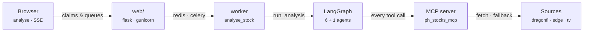

# 01 · Architecture & layering

Five processes, one direction of dependency. The web app never analyses; the worker never renders; every byte of market data crosses the **MCP server** — there is no in-process fallback. ★ marks the freshness invariant the caching design exists to protect.

*Fig. 1 — the path every analysis follows.*

> **★ Trading-hours freshness.** Prices settle at the 15:00 Asia/Manila close, so a report generated after the close is *the* report until the next trading day's close — weekends (and, when configured, holidays) roll forward. During the 09:00–15:00 session the app shows the last report with a "market open" note instead of analysing a moving target. Concurrency is part of the same contract: the first requester wins an atomic `SET NX` claim with a pre-generated task id; everyone else attaches to that run's progress stream via an SSE snapshot. One ticker, one boundary window, at most one LLM spend.

## The layers

### `web/` — delivery boundary

Routes, passkey-first auth (emailed 6-digit code at sign-up, OAuth recovery), per-user rate limit (5/day, atomic reserve/release), the same-ticker dedup claim, SSE progress, and Celery dispatch. Tala UI: console layout on desktop, stream on mobile.

> **Never:** analysis logic, LLM calls, data fetching.

### `graph/` · `agents/` — the analysis

`build_graph()`: a validation gate, then a registry-driven fan-out to six specialists, fan-in to the consolidator. Each agent resolves its own LLM from `AGENT_LLM_SPECS` (`[provider:]tier`) — adding an agent is one registry row, not a graph rewrite.

Graph nodes: `validate` → `price_agent` · `dividend_agent` · `movement_agent` · `valuation_agent` · `controversy_agent` · `sentiment_agent` → `consolidator` (large tier).

### `data/` — models & data plane

Pydantic models, the MCP client, and agent tools. **All fetching dispatches through the MCP server** (`MCP_SERVER_URL` is a hard requirement). `services/` holds the shared analysis logic the MCP server itself serves — one implementation, two callers.

> **Never:** DragonFi outage ≠ not-listed — symbol validation is tri-state with PSE Edge fallbacks.

### `infra/` — wiring & policy

`config.py` (env-backed `Settings`, LLM factory, singletons) · `repository*.py` (reports, users, credentials) · `email.py` (Tala-styled report & verification mail) · `trading_calendar.py` (the ★ rule) · Langfuse tracing · logging.

> **Never:** config is read here and only here — modules receive values, never the environment.
